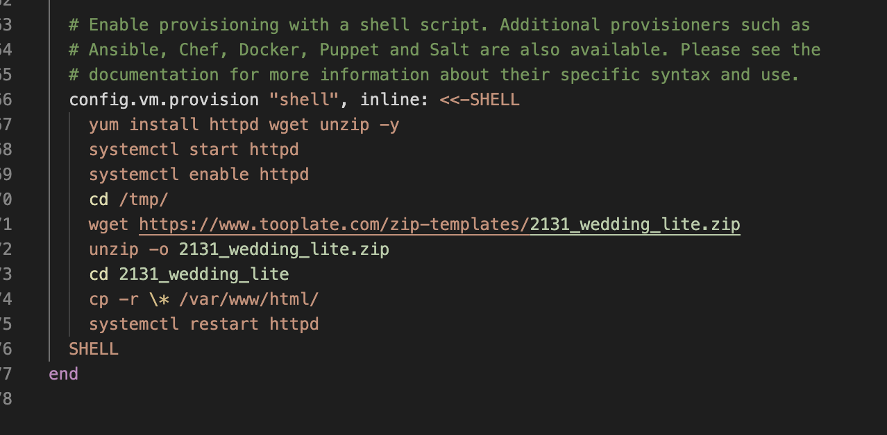
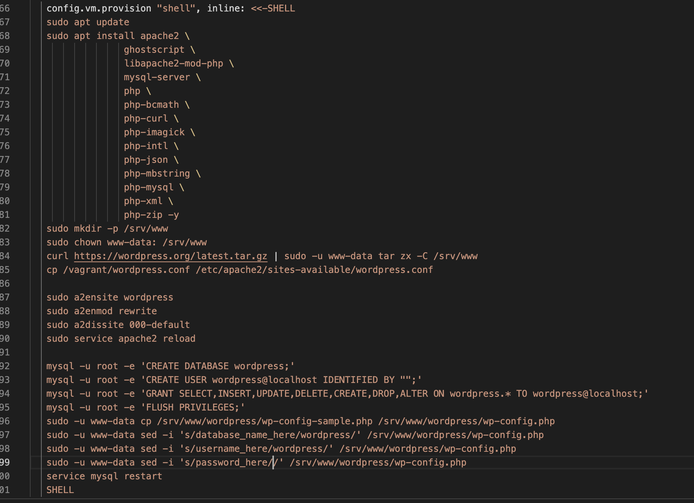
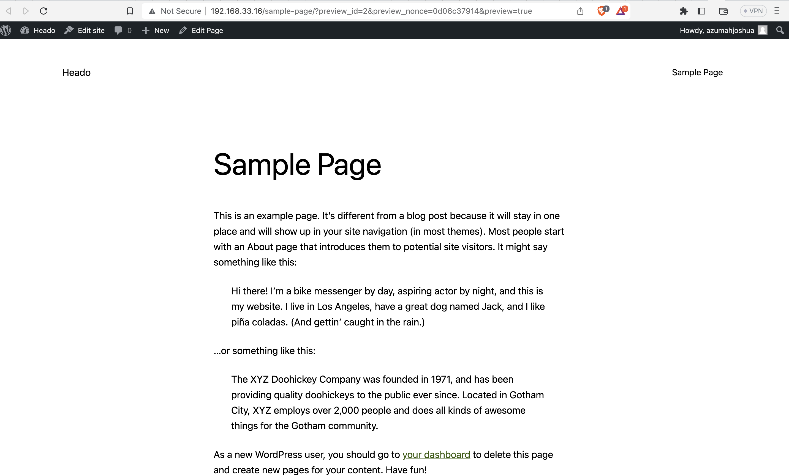

# IAC (Infrastructure as code)

Infrastructure as code (IaC) is an approach to managing and provisioning IT infrastructure in a programmatic and automated manner, using code and software development techniques such as version control, continuous integration/continuous delivery (CI/CD), and testing. With IaC, infrastructure resources are defined and configured through code, rather than manually configuring servers, networks, and other components

In this project we provisoning two project.

- static website
- wordpress website

## Automate setting up a static website using vagrant provisoning

## Automate setting up a wordpress website using vagrant provisoning

## Preview

